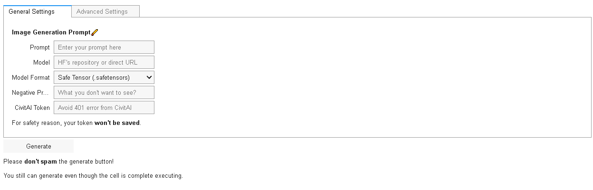
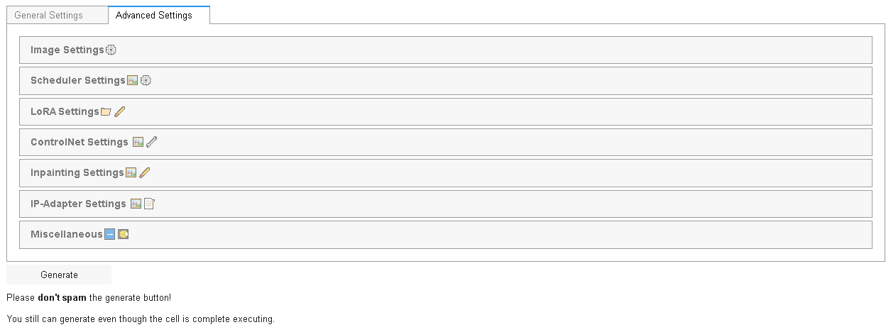
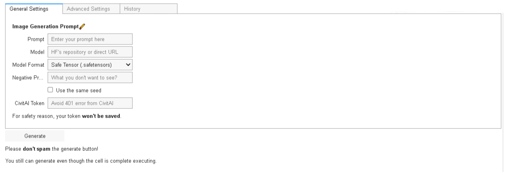
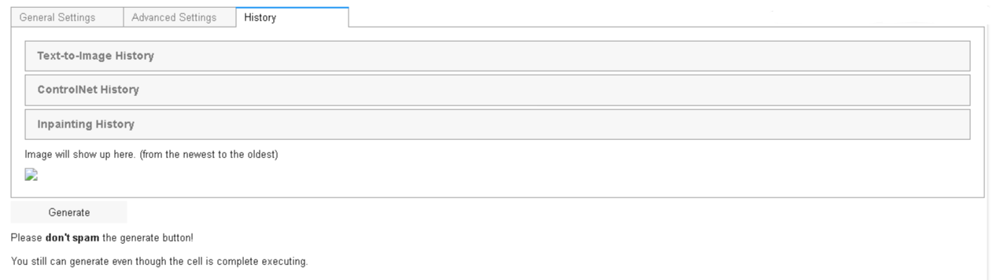

# Google Colab Non WebUI Stable Diffusion XL Image Generator

This is a simple Google Colab notebook made by a junior programmer for generating images using Stable Diffusion XL.

## Features
- **Image Generation:** Uses Transformers and Diffusers as the major components for image generation, along with ControlNet, Inpainting, and IP-Adapter.
- **Download and Load:** Ability to download and load images, checkpoint, LoRA weights, and VAE using direct URLs.
- **Textual Inversion:** Ability to load embeddings for more output control. (V3 and above only)
- **Image-to-Image:** Turn your images into something more creative and unique. (V3 and above only)
- **Prompt Generator:** Generate creative prompt powered by GPT-2. (Thank you [Gustavosta](https://huggingface.co/Gustavosta) for the amazing model)
- **Google Drive Integration:** Can connect to your Google Drive or disable it.
- **User-Friendly UI:** Simplified complexity with an easy-to-understand user interface.
- **IPyWidgets:** Simplified UI so that you don't need to scroll up and down. (V2 and above only)
- **Built-in History System:** Can show all of your previously generated images in Google Drive without opening it, just with a few simple clicks. (V2.5 and above only)
- **CivitAI Token Support:** Pass your CivitAI token for additional functionality, but remember **never share it with anyone.**
- **Hugging Face Token Support:** Pass your Hugging Face token for accessing private files, but remember **never share it with anyone.**
- **Simplicity:** Consists of two cells only.
- **Written Guide:** Can keep you on track with the flow of this notebook.

## Usage
This notebook is designed for artistic purposes and to spark inspiration. **Please use it responsibly.** Creating deepfakes and uploading them online are strictly prohibited.

## Installation
Simply open the notebook on Google Colab to start using it. No installation is needed. Debugging and editing the code might be difficult due to the complex structure and my lack of knowledge in modular programming.
- **V1:** 
- **V2:** 
- **V2.5:** 

## Disclaimer
- This tool is intended for creating art and exploring creative image generation.
- **Use responsibly.** Please refrain from using it for any malicious or harmful activities.
- NSFW generation is supported, but do it at your own risk.

## Feature Table

| Features                                                                              | V1 | V2 | V2.5 |  Beta V3 |
|---------------------------------------------------------------------------------------|----|----|------|----------|
| Base pipelines (ControlNet, VAE, Inpainting, Text2Img)                                | ✅ | ✅ | ✅  |    ✅    |
| Base adapters (LoRA, IP-Adapter)                                                      | ✅ | ✅ | ✅  |    ✅    |
| IPyWidgets                                                                            | ❌ | ✅ | ✅  |    ✅    |
| Saving and loading parameters                                                         | ❌ | ✅ | ✅  |    ✅    |
| Interactive UI                                                                        | ❌ | ✅ | ✅  |    ✅    |
| Linking widgets                                                                       | ❌ | ❌ | ✅  |    ✅    |
| History system                                                                        | ❌ | ❌ | ✅  |    ✅    |
| Upload images directly                                                                | ❌ | ❌ | ✅  |    ✅    |
| Image-to-image                                                                        | ❌ | ❌ | ❌  |    ✅    |
| Textual inversion or embeddings                                                       | ❌ | ❌ | ❌  |    ✅    |
| Send images from history to Image-to-image, ControlNet, Inpainting, and/or IP-Adapter | ❌ | ❌ | ❌  |    ✅    |
| Reset button (defaulting the parameters)                                              | ❌ | ❌ | ❌  |    ✅    |
| Compatibility with saved parameters from previous versions                            | ❌ | ❌ | ❌  |    ✅    |
| Preset system (saving and loading custom parameters)                                  | ❌ | ❌ | ❌  |    ✅    |
| GPT-2 prompt generator                                                                | ❌ | ❌ | ❌  |    ✅    |
| Hugging Face token integration                                                        | ❌ | ❌ | ❌  |    ✅    |

## Preview

 
 **V1:** 

The resolution is too big. [Consider checking it manually.](docs/v1/v1.png) 

 
 **V2:** 

 

 
 **V2.5:** 

 

## To-do List
- Adding textual inversion ✅ (beta V3)
- Implementing Inpainting using IPyCanvas
- Adding Hugging Face's token integration ✅ (beta V3)
- Implementing Img2Img pipeline ✅ (beta V3)
## License
This project is open-source and free to use under the MIT License.

---

This README was mostly made by ChatGPT. (I suck at creating markdown)
