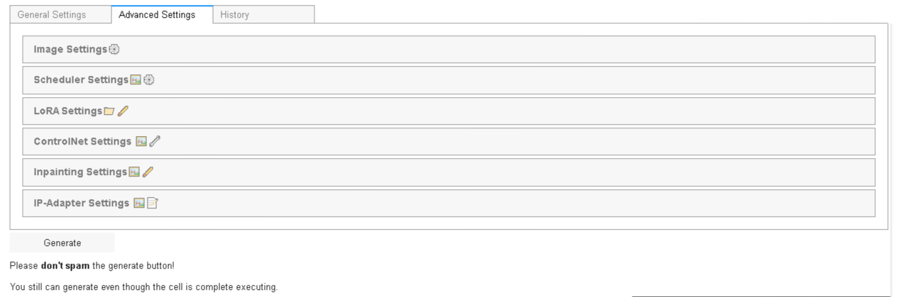

# Google Colab Non WebUI Stable Diffusion XL Image Generator (Legacy Version)

This is the legacy branch of this repository to contain the old versions of the notebook.

## Features Overview
- **Image Generation:** Uses Transformers and Diffusers as the major components for image generation, along with ControlNet, Inpainting, and IP-Adapter.
- **Download and Load:** Ability to download and load images, checkpoint, LoRA weights, and VAE using direct URLs.
- **Textual Inversion:** Ability to load embeddings for more output control. (Beta V3 and above only)
- **Image-to-Image:** Turn your images into something more creative and unique. (Beta V3 and above only)
- **Prompt Generator:** Generate creative prompt powered by GPT-2. (Model by [Gustavosta](https://huggingface.co/Gustavosta)) (Beta V3 and above only)
- **Image Upscaling:** Using [Real-ESRGAN](https://github.com/xinntao/Real-ESRGAN) made by [xinntao](https://github.com/xinntao) and Real-ESRGAN's contributors. (Beta V3 and above only)
- **Google Drive Integration:** Can connect to your Google Drive or disable it.
- **User-Friendly UI:** Simplified complexity with an easy-to-understand user interface.
- **IPyWidgets:** Simplified UI so that you don't need to scroll up and down. (Beta V2 and above only)
- **Built-in History System:** Can show all of your previously generated images in Google Drive without opening it, just with a few simple clicks. (V2.1 and above only)
- **CivitAI Token Support:** Pass your CivitAI token for additional functionality, but remember **never share it with anyone.**
- **Hugging Face Token Support:** Pass your Hugging Face token for accessing private files, but remember **never share it with anyone.** (Beta V3 and above only)
- **Simplicity:** Consists of two cells only.
- **Written Guide:** Can keep you on track with the flow of this notebook. (Before V3 only)

## Usage
This notebook is designed for artistic purposes and to spark inspiration. **Please use it responsibly.** Creating deepfakes and uploading them online are strictly prohibited.

## Installation
Simply open the notebook on Google Colab to start using it. No installation is needed. Debugging and editing the code might be difficult due to the complex structure and my lack of knowledge in modular programming.

 
 Release Versions: 

- **V1:** 
- **V2:** 
- **V2.1:** 
- **V3 (current version):** 

 
 Pre-release Versions: 

- **Alpha V1:** 
- **Beta V2:** 
- **Beta V3:** 

 
Feature Table:

  
| No. | Features                                                                              | V1 | V2 | V2.1 | V3 |
|-----|---------------------------------------------------------------------------------------|----|----|------|----|
| 1   | Base pipelines (ControlNet, VAE, Inpainting, Text2Img)                                | ✅  | ✅  | ✅    | ✅  |
| 2   | Base adapters (LoRA, IP-Adapter)                                                      | ✅  | ✅  | ✅    | ✅  |
| 3   | IPyWidgets                                                                            | ❌  | ✅  | ✅    | ✅  |
| 4   | Saving and loading parameters                                                         | ❌  | ✅  | ✅    | ✅  |
| 5   | Interactive UI                                                                        | ❌  | ✅  | ✅    | ✅  |
| 6   | Linking widgets                                                                       | ❌  | ❌  | ✅    | ✅  |
| 7   | History system                                                                        | ❌  | ❌  | ✅    | ✅  |
| 8   | Upload images directly                                                                | ❌  | ❌  | ✅    | ✅  |
| 9   | Image-to-image                                                                        | ❌  | ❌  | ❌    | ✅  |
| 10  | Textual inversion or embeddings                                                       | ❌  | ❌  | ❌    | ✅  |
| 11  | Send images from history to Image-to-image, ControlNet, Inpainting, and/or IP-Adapter | ❌  | ❌  | ❌    | ✅  |
| 12  | Reset button (defaulting the parameters)                                              | ❌  | ❌  | ❌    | ✅  |
| 13  | Compatibility with saved parameters from previous versions                            | ❌  | ❌  | ❌    | ✅  |
| 14  | Preset system (saving, loading, renaming, and deleting custom parameter presets)      | ❌  | ❌  | ❌    | ✅  |
| 15  | GPT-2 Prompt Generator                                                                | ❌  | ❌  | ❌    | ✅  |
| 16  | Hugging Face token integration                                                        | ❌  | ❌  | ❌    | ✅  |
| 17  | Real-ESRGAN Image Upscaling                                                           | ❌  | ❌  | ❌    | ✅  |
| 18  | Modular programming                                                                   | ❌  | ❌  | ❌    | ✅  |
| 19  | New parameter saving system & legacy conversion                                       | ❌  | ❌  | ❌    | ✅  |
| 20  | URL saving system for model       sources                                             | ❌  | ❌  | ❌    | ✅  |
| 21  | One-model-for-all-pipelines system                                                    | ❌  | ❌  | ❌    | ✅  |
| 22  | Preview button for ControlNet-converted image                                         | ❌  | ❌  | ❌    | ✅  |
| 23  | `components` integration for shared tensor memory                                     | ❌  | ❌  | ❌    | ✅  |
| 24  | `ControlNetUnion` memory-efficient implementation                                     | ❌  | ❌  | ❌    | ✅  |
| 25  | Corrupted-download deletion logic                                                     | ❌  | ❌  | ❌    | ✅  |
| 26  | Preview & remove buttons for IP-Adapter uploads                                       | ❌  | ❌  | ❌    | ✅  |
| 27  | `ipycanvas` drawing for inpainting masks (unstable)                                   | ❌  | ❌  | ❌    | ✅  |
| 28  | Pagination in history system                                                          | ❌  | ❌  | ❌    | ✅  |
| 29  | Multiple images per generation                                                        | ❌  | ❌  | ❌    | ✅  |
| 30  | Default model selections (12 models preloaded)                                        | ❌  | ❌  | ❌    | ✅  |
| 31  | Hires.Fix with Real-ESRGAN and LANCZOS upscaling                                      | ❌  | ❌  | ❌    | ✅  |
| 32  | Delete button for history system                                                      | ❌  | ❌  | ❌    | ✅  |
| 33  | Combobox widgets for VAE, checkpoint, LoRA, and embeddings from URLs                  | ❌  | ❌  | ❌    | ✅  |

## Disclaimer
- This tool is intended for creating art and exploring creative image generation.
- **Use responsibly.** Please refrain from using it for any malicious or harmful activities.
- NSFW generation is supported, but do it at your own risk.

## Preview

 
 <b>V1:</b> 
  
  
The resolution is too big. [Consider checking it directly](docs/v1/v1.png).

 
 <b>V2:</b> 
  
  

 

 
 <b>V2.1:</b> 
  
  

 

 
 <b>V3:</b> 

 
  
Check out the preview from the main branch [here](https://github.com/ZicoDiegoRR/stable-diffusion-xl-colab-ui/tree/main#preview).

## License
This project is open-source and free to use under the MIT License.

---

This README was mostly made by ChatGPT. (I suck at creating markdown)
